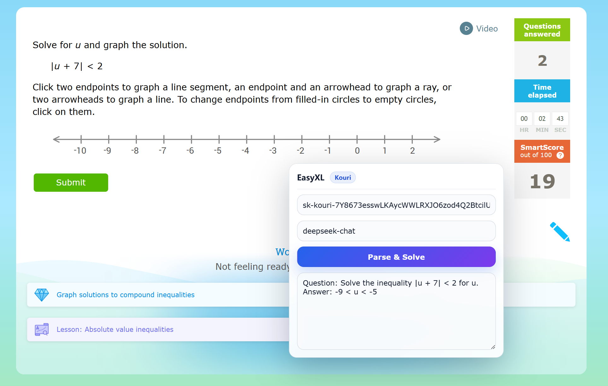

# EasyXL

English | [简体中文](README-cn.md)

Tampermonkey userscripts for AI auto-solving questions on IXL pages. They add a floating panel to the page, extract the question-area HTML, and call different model providers to parse the question and produce an answer.

## Features

- Floating UI on IXL pages (draggable)
- Press Ctrl (tap-and-release, not Ctrl+something) to toggle show/hide
- Extracts the question area HTML (`section.ixl-practice-crate` / `section.question-and-submission-view` / `section.question-view`)
- **User Notes**: Allows you to add custom instructions or context before parsing, which will be sent to the AI.
- Uses `GM_xmlhttpRequest` to bypass the page CSP for cross-origin requests
- **Smart Answer Extraction**: Instructs AI to perform step-by-step reasoning but only extracts and displays the final concise answer.
- **Supports rich Markdown rendering and Math equations (using KaTeX)** in the result box

## Prerequisites

- Tampermonkey (or a compatible userscript manager) installed in your browser
- A valid API key for the script you use

## Bookmarklet Version (No Extension Required)

If you don't want to install Tampermonkey, or are on a device where extensions are blocked, you can use the **Bookmarklet version** (experimental, might be subject to page CSP restrictions).

1. Open your browser bookmarks manager and create a new bookmark.
2. Name it "EasyXL Solver".
3. Copy the entire contents of `bookmarklet.txt` and paste it into the "URL" field.
4. When you are on an IXL question page, simply click the bookmark to inject the EasyXL interface!

## Scripts

- Kouri: [easyxl-kouriapi.js](easyxl-kouriapi.js)
- DeepSeek: [easyxl-deepseek.js](easyxl-deepseek.js)
- OpenAI: [easyxl-openai.js](easyxl-openai.js)
- Gemini: [easyxl-gemini.js](easyxl-gemini.js)

## Install & Use

1. Open Tampermonkey and create a new script.
2. Pick one script from the list above and copy its full content into the editor, then save.
3. Open any IXL practice page (e.g. https://www.ixl.com/math/algebra-1/graph-solutions-to-absolute-value-inequalities).
4. The “EasyXL” floating panel appears in the bottom-right:
   - Enter your API key (saved to `localStorage`)
   - Optional: change the model name
   - Click `Parse & Solve` to start, the question will be sent to the AI
   - When the AI finnish the question, the answer will appear in the answer box

## Local Storage Keys

- Kouri: `easyxl_kouri_api_key`, `easyxl_kouri_model`
- DeepSeek: `easyxl_deepseek_api_key`, `easyxl_deepseek_model`
- OpenAI: `easyxl_openai_api_key`, `easyxl_openai_model`
- Gemini: `easyxl_gemini_api_key`, `easyxl_gemini_model`

## Notes

- The script sends the question-area HTML to the API for parsing. Make sure you understand and accept this behavior.
- The API key is stored in `localStorage`. Do not use it on untrusted machines or profiles.

## Contributing

Issues and Pull Requests are welcome.
